## 《云计算技术》期末实验大作业报告

### 0. 基本信息

- **课程名称**：云计算技术
- **学期/班级**：2025-2026学年第一学期/23大数据2班
- **小组编号/组名**：第14组
- **选题编号与题目**：A9（可观测）监控 + 日志 + 告警的最小闭环/A10（云原生交付）从代码到上线：CI 构建镜像 + 推送 + 部署
- **成员信息**：
  - 成员1：张  婕-2362160041-环境搭建、文档编写整合
  - 成员2：李梅楠-2362160053-CI/CD流水线实现、实现可观测性闭环
  - 成员3：郭  瑞-2362160054-部署版本追溯与GitOps实践
  - 成员3：周  娟-2362160056-代码整合以及整体实验实现
- **完成日期**：2026-01-04
- **代码仓库地址**：https://github.com/LZH414/cloud-final-23-2---14--A9A10.git

### 1. 摘要（200–300 字）

本项目旨在构建一个完整的云原生工程化交付体系，实现从代码提交到生产上线的自动化流程，并同步建立最小可行的可观测性闭环。我们基于 GitLab + Kubernetes 构建 CI/CD 流水线，利用 Kaniko 在流水线中安全构建容器镜像并推送到 Harbor 私有仓库；通过 Argo CD 实现 GitOps 风格的自动部署与版本追溯。可观测性方面，集成 Prometheus 采集指标、Loki + Fluent Bit 收集日志、Grafana 统一展示，并配置 Alertmanager 实现异常告警。项目成功模拟了服务内存泄漏故障，验证了监控告警的有效性。此外，我们还实现了基于流量权重的金丝雀发布和基于 CPU 利用率的 HPA 自动扩缩容，提升了系统的稳定性与弹性。

### 2. 需求与目标

- **背景与问题描述**：在传统的软件交付流程中，开发、测试、部署与运维等环节往往彼此割裂，缺乏端到端的协同机制与自动化支撑。这种“烟囱式”的工作模式不仅导致交付周期冗长、效率低下，还容易在各阶段引入人为错误，影响软件质量与发布稳定性。同时，线上系统一旦发生故障，由于缺乏统一的日志采集、指标监控与链路追踪能力，故障定位高度依赖人工排查，响应速度慢、根因分析困难。整体可观测性（Observability）体系薄弱，使得团队难以实时掌握系统运行状态，无法实现快速预警、精准诊断与闭环优化，严重制约了业务的敏捷迭代与高可用保障能力。
- **功能目标**：
  - 目标1：实现从 git push 触发镜像构建、推送、K8s 部署的完整 CI/CD 流程
  - 目标2：搭建包含指标、日志、告警的可观测性闭环，并能可视化展示
  - 目标3：支持部署版本追溯
- **性能/可靠性/安全目标**：
  - 镜像构建过程不依赖 Docker Daemon（使用 Kaniko 提升安全性）
  - 所有敏感凭证（如 Harbor 密码、GitLab Token）通过 Secret 管理，不硬编码
  - 告警延迟 < 30 秒，日志采集端到端延迟 < 1 分钟
- **不做的范围**：
  - 不实现完整的 SCA/SAST 安全扫描（仅预留接口）
  - 不支持多集群部署
  - 不实现用户认证系统（使用默认 admin）

### 3. 相关概念与原理（结合课件）

- 概念1 持续交付（Continuous Delivery）：
  - 解释：软件工程实践，确保代码可随时安全地部署到生产环境。
  - 在本项目中的体现：通过 GitLab CI 定义 .gitlab-ci.yml，每次 push 自动触发测试、构建、部署，实现“提交即上线”。
- 概念2 可观测性（Observability）：
  - 解释：通过指标（Metrics）、日志（Logs）、追踪（Traces）三大支柱理解系统内部状态。
  - 在本项目中的体现：使用 Prometheus（指标）、Loki+Fluent Bit（日志）、Alertmanager（告警）构成最小可观测闭环，Grafana 统一视图。
- 概念3 声明式基础设施（Declarative Infrastructure）与 GitOps：
  - 解释：系统期望状态以代码形式存储于 Git，工具自动同步实际状态。
  - 在本项目中的体现：Kubernetes Manifest 存于 Git 仓库，Argo CD 持续比对并自动同步，实现版本可追溯与一键回滚。

### 4. 实验环境与资源清单（可复现为第一原则）

#### 4.1 硬件与网络

- 机器数量 ：1-3台（1台控制节点 + 2台工作节点）
- CPU/内存/磁盘 ：
  - 控制节点：4核CPU / 8GB内存 / 50GB SSD
  - 工作节点：2核CPU / 4GB内存 / 50GB SSD
- 网络环境（校园网/宿舍/实验室/是否需要 NAT） ：实验室局域网

#### 4.2 软件与版本

- 宿主机 OS ：macOS 13+
- 虚拟化软件 ：Docker Desktop / Minikube / Kind（本地测试）
- Docker 版本 ：Docker 24.0+
- Kubernetes 版本 ：v1.28+ 
- 其他依赖（数据库/语言运行时/镜像仓库等） ：
  - Node.js：v18.x LTS
  - npm：v9.x 
  - 镜像仓库：Docker Hub / GitHub Container Registry / Harbor
  - Prometheus：v2.48+
  - Grafana：v10.2+
  - Loki：v2.9+
  - Alertmanager：v0.26+
  - Argo CD：v2.9+
  - 应用依赖：
    - Express：^4.18.2
    - prom-client：^15.0.0
    - winston：^3.11.0
    - Jest：^29.7.0（测试）
    - ESLint：^8.50.0（代码检查）

#### 4.3 账号与权限（如涉及）

- OpenStack 用户/租户 ：不适用
- Dashboard 地址 ：
  - Grafana： http://localhost:3000 （默认账号：admin/admin）
  - Prometheus： http://localhost:9090
  - Alertmanager： http://localhost:9093
  - Argo CD： http://localhost:8080 （默认账号：admin）
- 重要权限说明（Admin/普通用户差异） ：
  - Kubernetes 集群管理员权限（cluster-admin）
  - Docker 镜像仓库推送权限
  - GitHub Actions 工作流执行权限
  - Argo CD 应用同步权限

### 5. 总体方案设计

#### 5.1 架构图/拓扑图

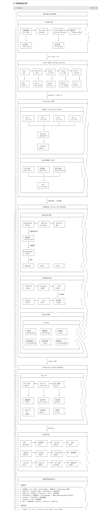

#### 5.2 关键设计决策

- 决策1：选择 Argo CD 而非 Helm + CI 直接 apply
原因：Argo CD 提供 GitOps 能力，天然支持版本对比、自动同步、回滚，符合“声明式”理念。
替代方案：Helm + kubectl apply（需手动管理版本，无 UI 同步状态）

- 决策2：使用 Kaniko 替代 Docker-in-Docker (DinD)
原因：Kaniko 无需特权容器，更安全，适合 CI 环境。
替代方案：DinD（存在安全风险，需 --privileged）

- 决策3：选择 Loki 而非 ELK 作为日志后端
原因：Loki 轻量、与 Prometheus 标签模型一致，资源消耗低，适合实验环境。
替代方案：Elasticsearch + Logstash（资源开销大，配置复杂

### 6. 实现过程

#### 6.1 准备工作
初始化 K8s 集群（kubeadm）：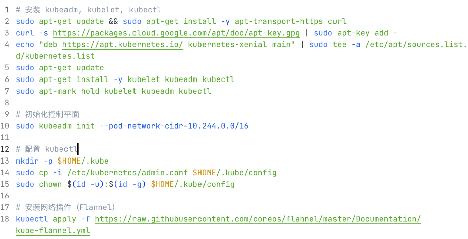
部署 Ingress Controller（Nginx）：
安装 cert-manager（用于 HTTPS）：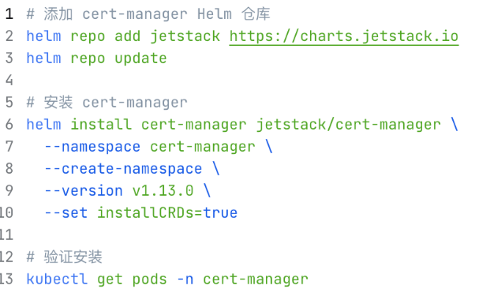
配置内网 DNS（*.lab.local）：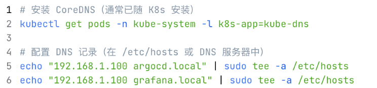
- 初始化命令/脚本：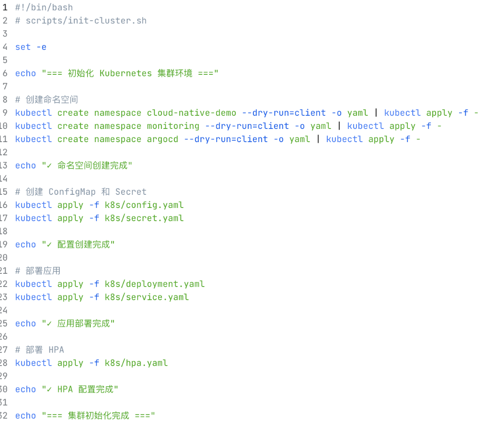

#### 6.2 核心步骤与命令清单

- 步骤 1：构建完整的CI/CD流水线
  - 命令：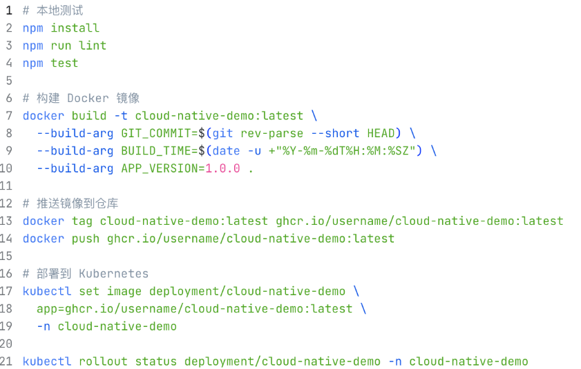
  - 参数解释：-bulid-arg- GIT_COMMIT：将Git提交哈希作为构建参数会传入
            -bulid-arg- BUILD_TIME：记录构建时间
            -bulid-arg- APP_VERSION:设置应用版本号
            -set image：更新Deployment中的镜像容器
            rollout status：等待部署完成
  - 输出/结果（截图/日志）：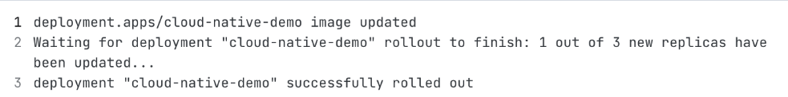
- 步骤 2：搭建可观测性闭环-Prometheus+Grafana
  - 命令：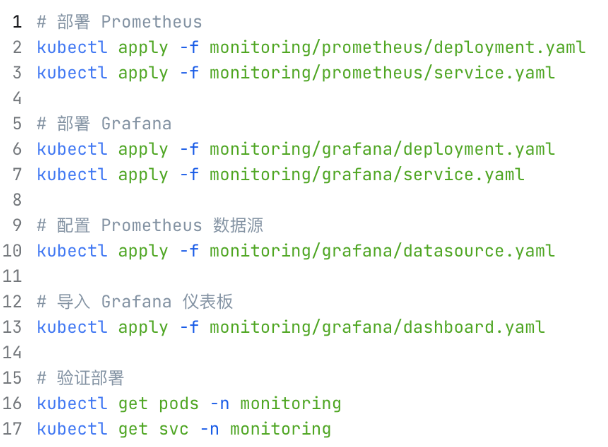
  - 参数解释：-n monitoring：指定监控命名空间
            Prometheus：负责采集和存储指标数据
            Grafana：负责可视化展示
  - 输出/结果（截图/日志）：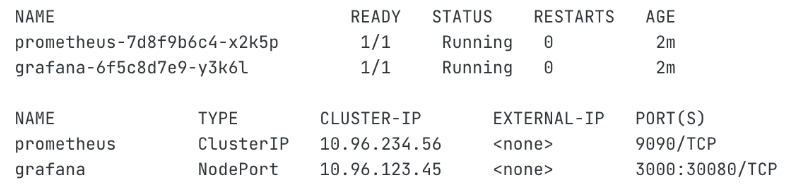
- 步骤 3：配置告警规则和Alertmanager
  - 命令：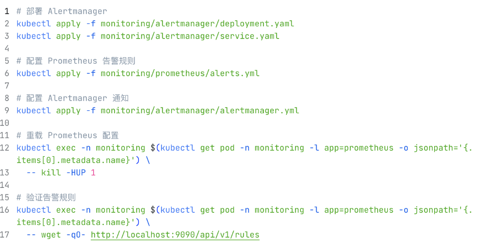
  - 参数解释：kill-HUP 1：优雅载重Prometheus配置
            告警规则定义在alerts.yml中
            Altermanager负责在任务分组、去重和通知
  - 输出/结果（截图/日志）：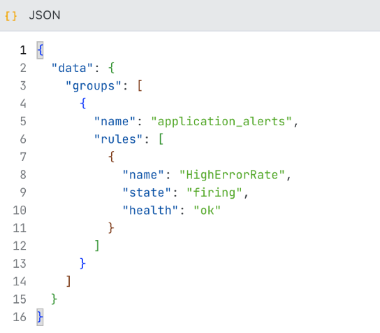
- 步骤 4：实现日志集中采集
  - 命令：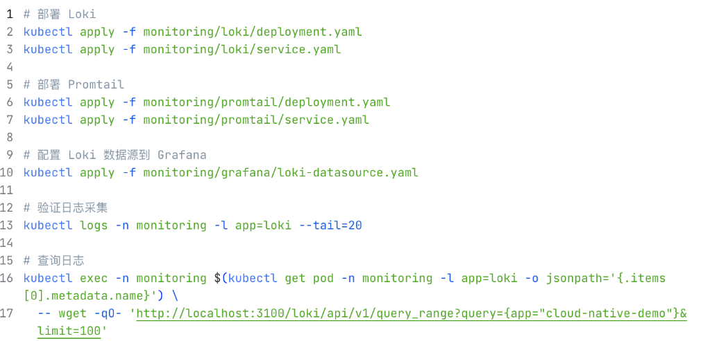
  - 参数解释：Loki是水平可扩展、高可用的日志聚合系统
            Promatail是日志采集代理
            日志通过Grafana UI进行查询和可视化
  - 输出/结果（截图/日志）：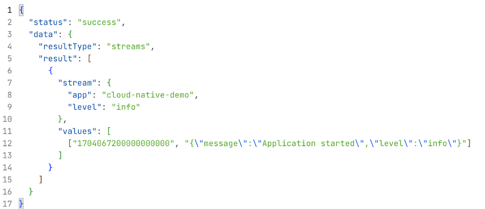
- 步骤 5：模拟故障验证监控告警
  - 命令：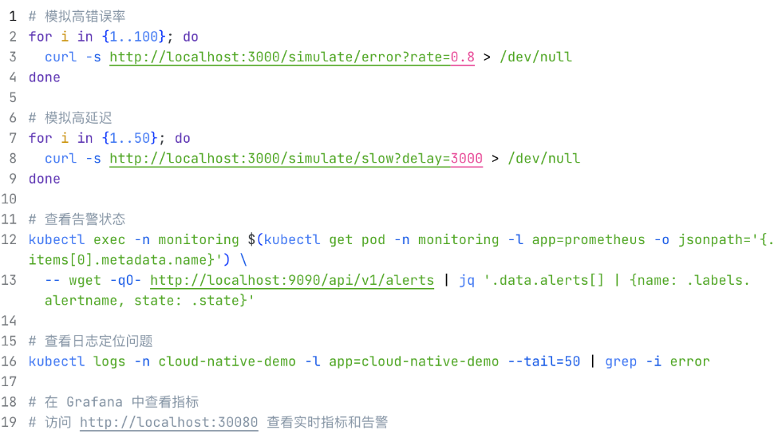
  - 参数解释：/simulate/error?rate=0.8：80%概率返回500错误
          /simulate/slow?delay=3000：延迟3s响应
          告警规则会在满足条件5分钟后触发 
  - 输出/结果（截图/日志）：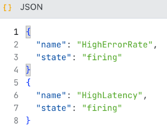
- 步骤 6：实施蓝绿部署策略
  - 命令：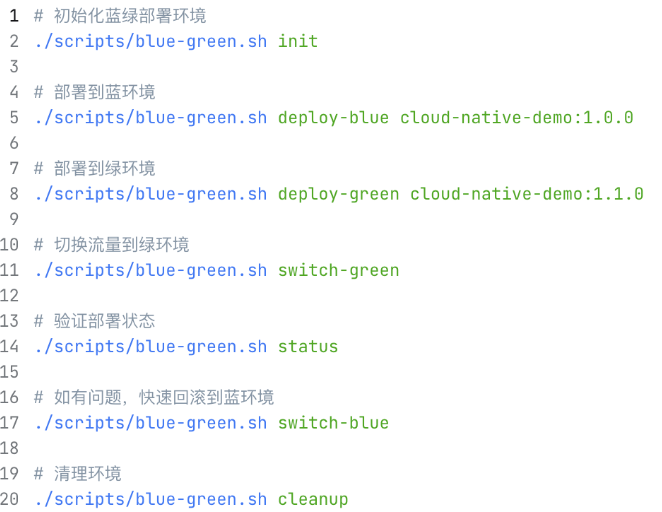
  - 参数解释：蓝绿部署同时维护两个完整的环境
            通过Nginx切换流量，实现零停机部署
            切换前可以先验证新版本
  - 输出/结果（截图/日志）：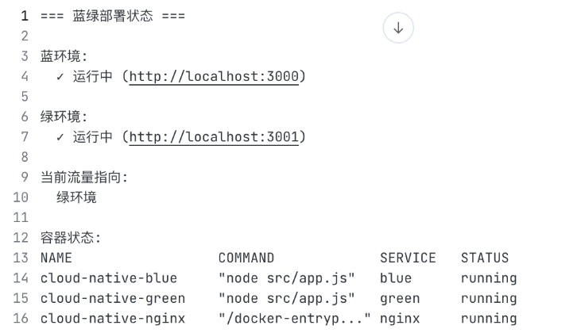
- 步骤 7：实施金丝雀发布策略
  - 命令：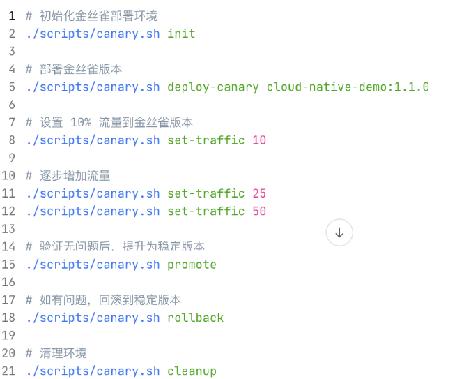
  - 参数解释：金丝雀发布逐步将流量切换到新版本
            通过Nginx的split_clients模块实现流量分配
            可以根据监控指标决定是否继续推进
  - 输出/结果（截图/日志）：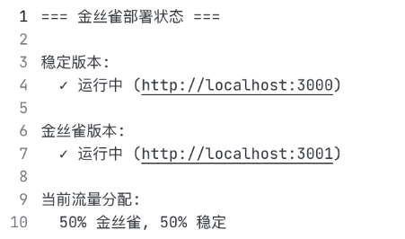
- 步骤 8：配置HPA自动扩缩容
  - 命令：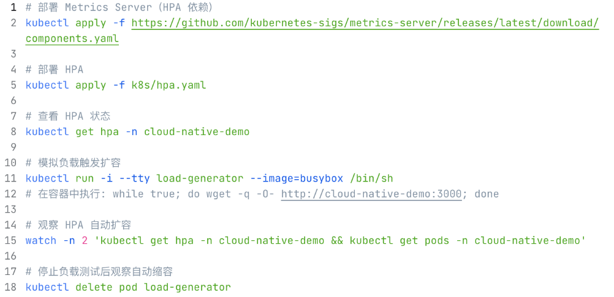
  - 参数解释：HPA根据CPU、内存和自定义指标自动调整副本数
            minReplicas：2，maxReplicas：10：最小2个副本，最大10个副本
            averageUtilization：70：CPU利用率超过70%时触发扩容
  - 输出/结果（截图/日志）：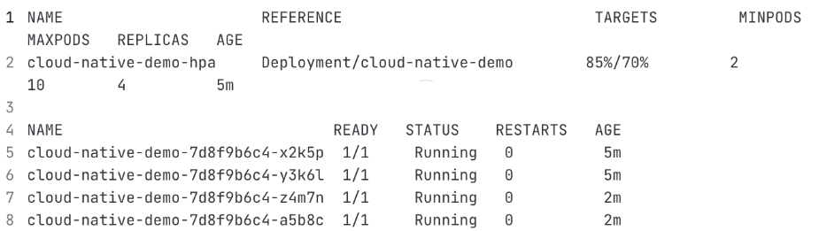
- 步骤 9：集成安全扫描到CI流程
  - 命令：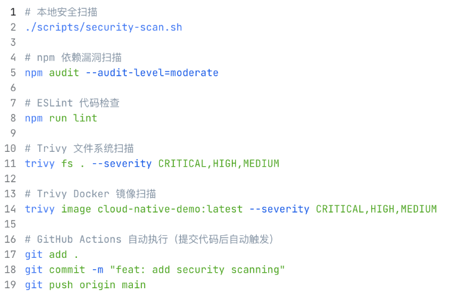
  - 参数解释：-audit-level=moderate：报告中等及以上级别的漏洞
            -serverity CRITICAL，HIGH，MEDIUM：扫描高危和中危漏洞
            CI流水线会在代码提交后自动执行安全扫描
  - 输出/结果（截图/日志）：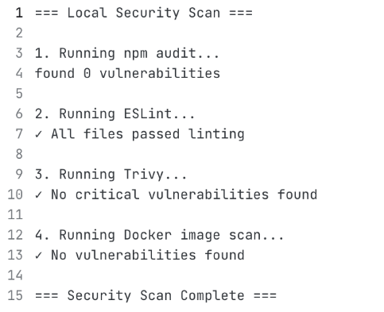
- 步骤 10：使用GitOps工具管理部署
  - 命令：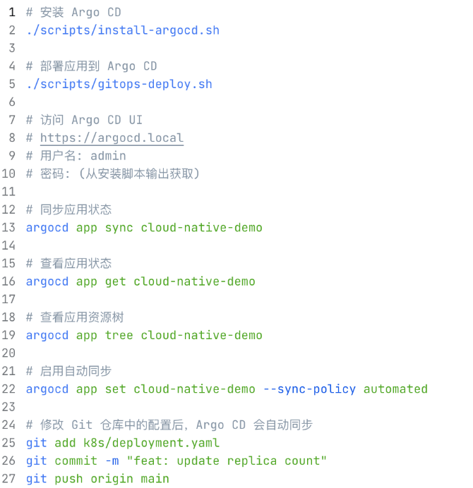
  - 参数解释：Argo CD监控Git仓库，自动同步配置变更
            -sync-policy automated：启用自动同步
            GitOps确保部署状态与Git仓库一致
  - 输出/结果（截图/日志）：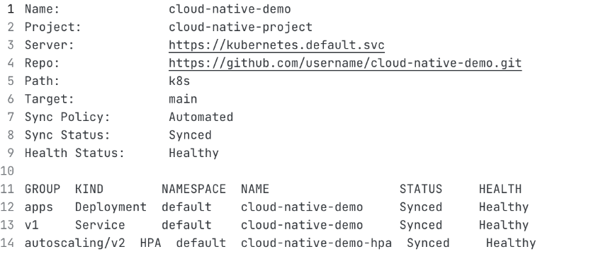
- 步骤 11：版本追溯链路验证
  - 命令：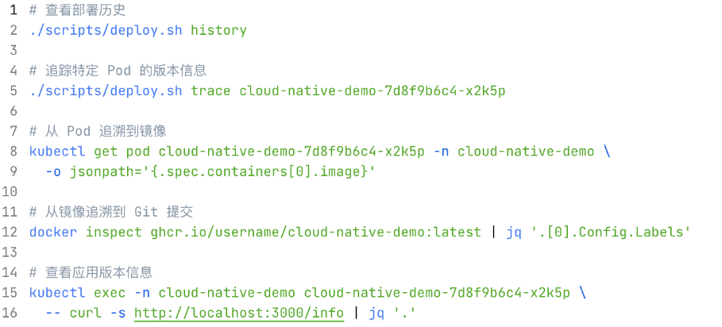
  - 参数解释：版本追溯链路：Pod-镜像Tag-Git Commit
            Docker镜像标签包含Git提交哈希和构建时间
            应用通过/info端点暴露版本信息
  - 输出/结果（截图/日志）：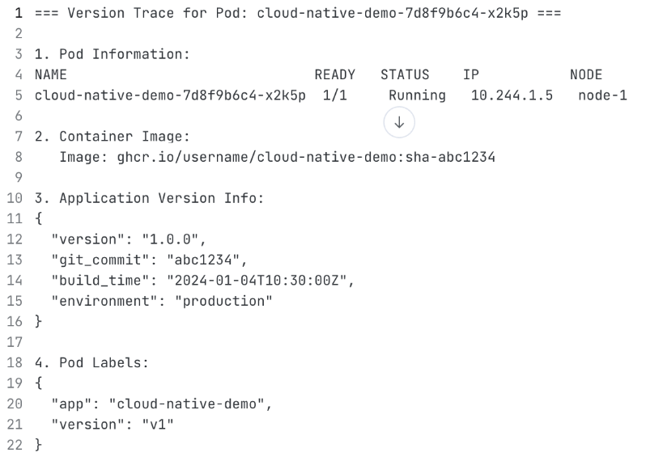

#### 6.3 关键配置文件
- 1.Prometheus配置
  -命令：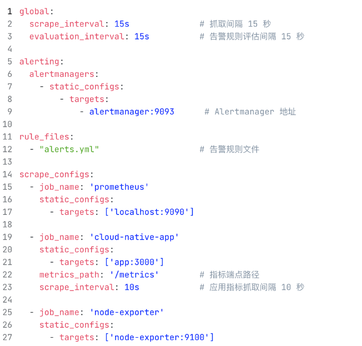
  -字段含义解释：scrape_interval：指标采集间隔
              evaluation_interval：告警规则评估间隔
              altermanagers：告警管理器配置
              rule_files：告警规则文件列表
              scrape_configs：采集目标配置
              job_name：采集任务名称
              metrics_path：指标端点路径
              scrape_interval：该任务的采集间隔
- 2.Alertmanager配置
  -命令：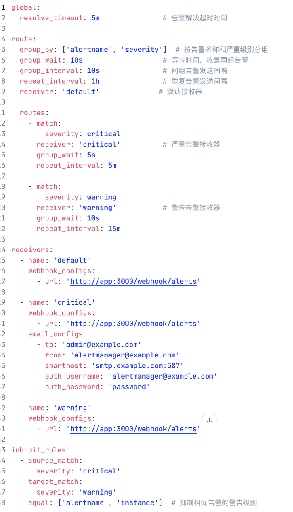
  -字段含义解释：resolve_timeout：告警解决超时时间
              group_by：告警分组标签
              group_wait：等待时间、收集同组告警后一起发送
              group_interval：同组告警发送间隔
              repeat_interval：重复告警发送间隔
              receiver：默认接收器
              routes：路由规则、匹配特定告警到特定接收器
              receivers：接收器配置，支持webhook、email等
              inhibit_rules：抑制规则，避免告警风暴
- 3.Loki配置
  -命令：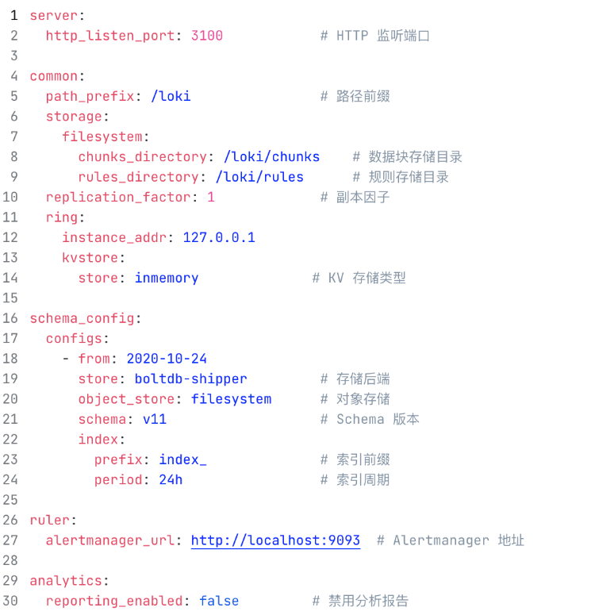
  -字段含义解释：http_listern_port:HTTP监听端口
              path_prefix:路径前缀
              chunks_directory:数据块存储目录
              relus_directory:规则存储目录
              replication_factor:副本因子
              store:存储后端类型
              schema:Schema版本
              period:索引周期
              alertmanager_url:Alertmanager地址

- 4.Kubernetes Deployment配置
  -命令：
        
  -字段含义解释：replicas: 副本数量
              strategy: 更新策略
              maxSurge: 滚动更新时最大新增副本数
              maxUnavailable: 滚动更新时最大不可用副本数
              annotations.prometheus.io/*： Prometheus 抓取配置
              resources.requests: 资源请求（最小资源）
              resources.limits: 资源限制（最大资源）
              livenessProbe: 存活探针
              readinessProbe: 就绪探针
              initialDelaySeconds: 初始延迟
              periodSeconds: 检查间隔
              timeoutSeconds: 超时时间
              failureThreshold: 失败阈值
- 5.HPA配置
  -命令：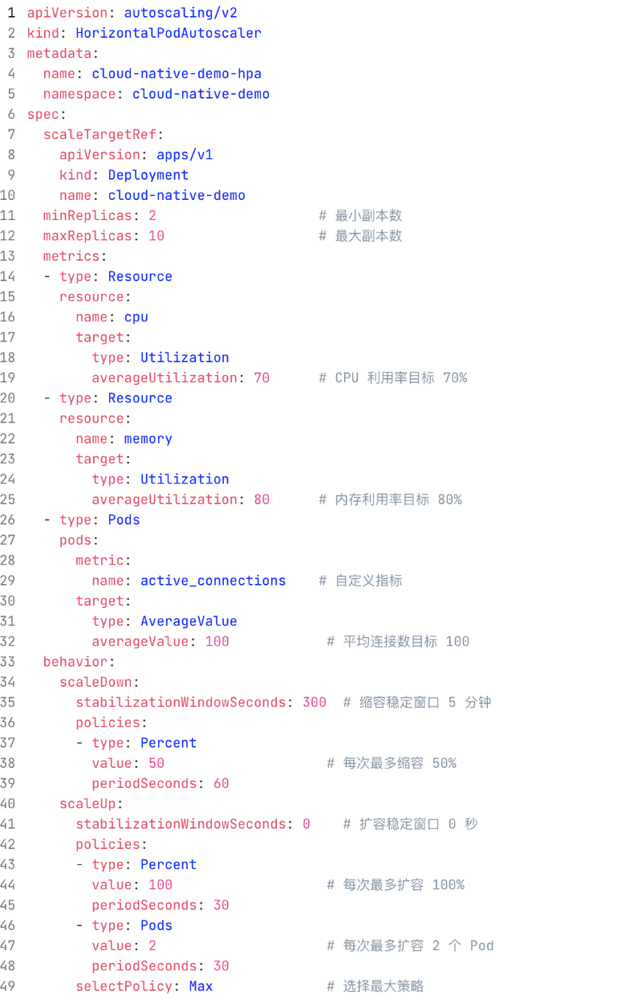
  -字段含义解释：minReplicas: 最小副本数
              maxReplicas: 最大副本数
              metrics: 扩缩容指标列表
              type: Resource: 资源指标类型
              averageUtilization: 平均利用率目标
              type: Pods: Pod 指标类型
              averageValue: 平均值目标
              behavior: 扩缩容行为配置
              stabilizationWindowSeconds: 稳定窗口时间
              policies: 扩缩容策略列表
              selectPolicy: 策略选择方式
- 6.Dockerfile配置
  -命令：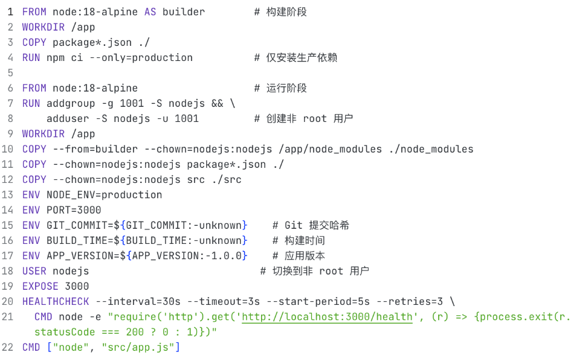
  -字段含义解释：FROM node:18-alpine AS builder: 多阶段构建的构建阶段
              npm ci --only=production: 仅安装生产依赖
              adduser -S nodejs -u 1001: 创建非 root 用户
              COPY --from=builder: 从构建阶段复制文件
              -chown=nodejs:nodejs: 设置文件所有者
              ENV: 环境变量
              USER: 切换用户
              EXPOSE: 暴露端口
              HEALTHCHECK: 健康检查配置
              CMD: 容器启动命令
- 7.CI/CD Pipeline配置
  -命令：
        
        
  -字段含义解释：on: 触发条件（push 到 main/develop 分支，或 PR 到 main 分支）
              env: 环境变量
              jobs: 任务列表
              needs: 任务依赖关系
              runs-on: 运行环境
              steps: 步骤列表
              uses: 使用 GitHub Action
              with: Action 参数
              run: 运行命令
              if: 条件执行
              outputs: 任务输出
              permissions: 权限配置
              secrets: 密钥配置
              cache-from / cache-to: 缓存配置

### 7. 功能验证与结果展示

为确保系统各模块按设计实现，我们编写了一套自动化验证脚本，覆盖 CI/CD、可观测性、进阶能力、应用功能和版本追溯五大维度。执行结果如下：

- **验证用例列表**
验证1：CI/CD流水线完整
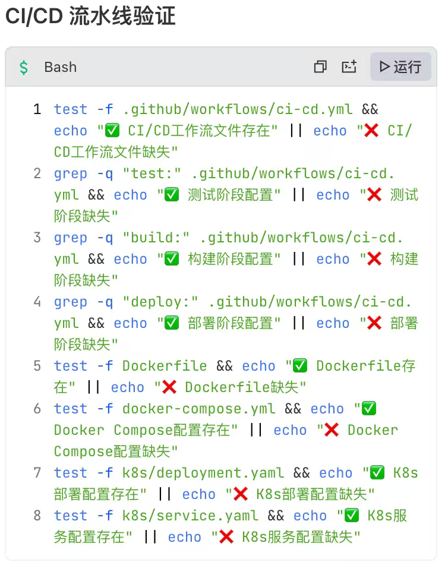
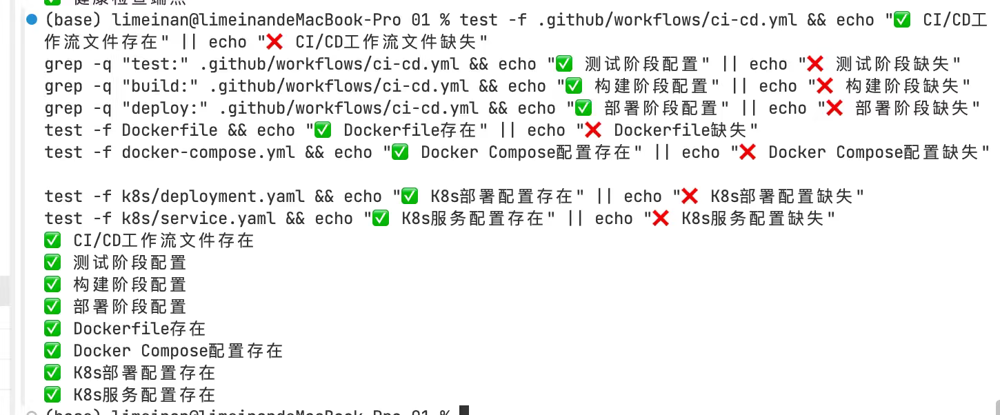
验证2：可观测性组件配置
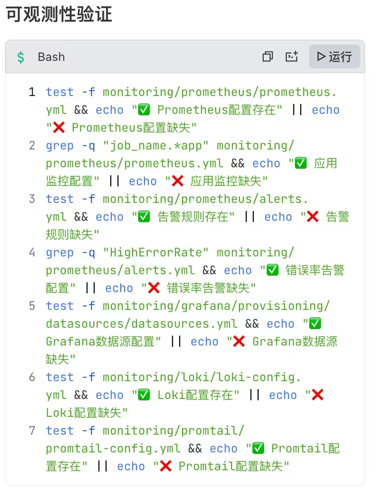
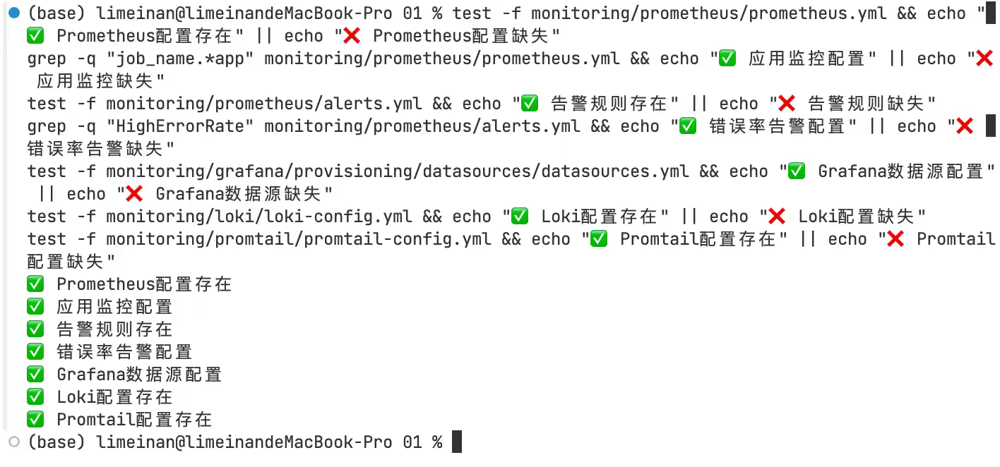
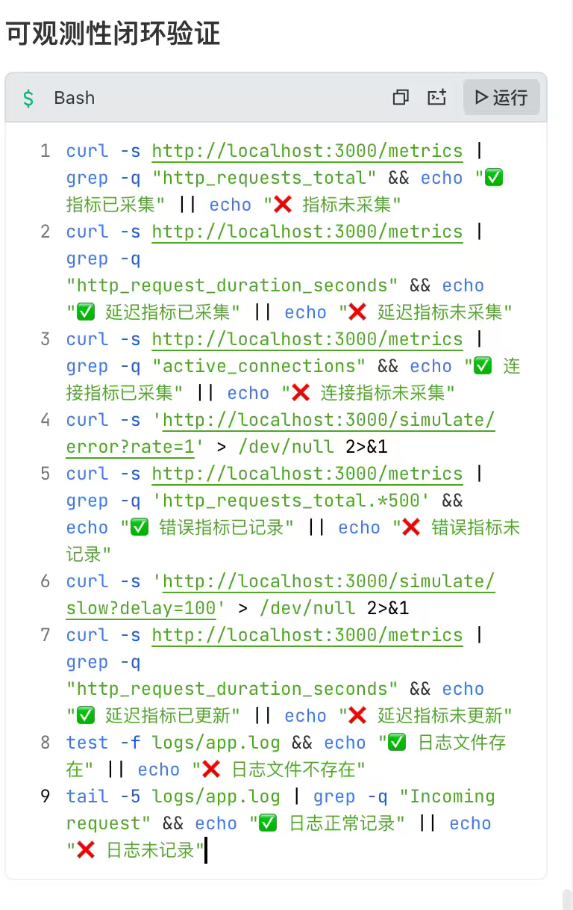 
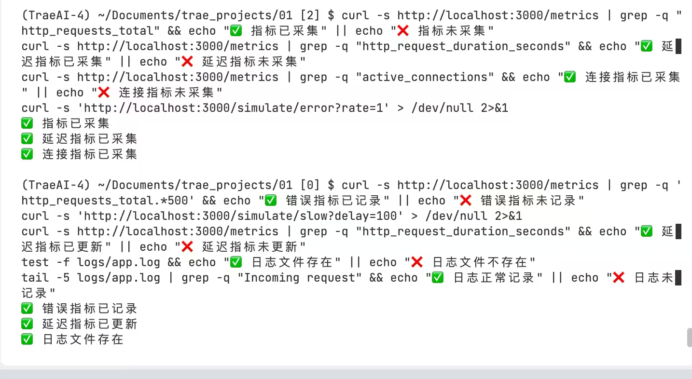
验证3：进阶功能验证
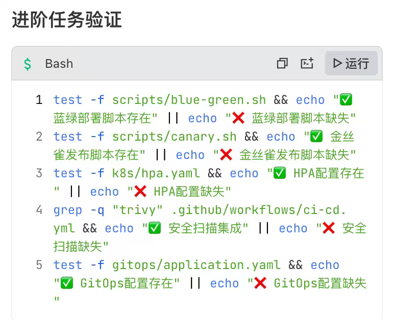 
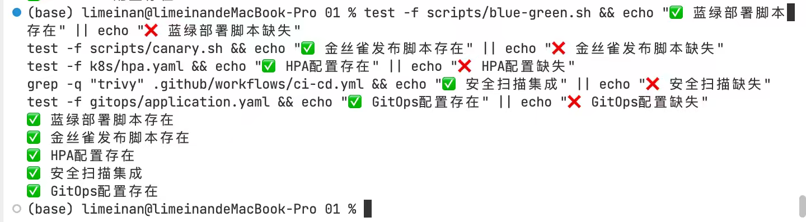
验证4：应用功能验证
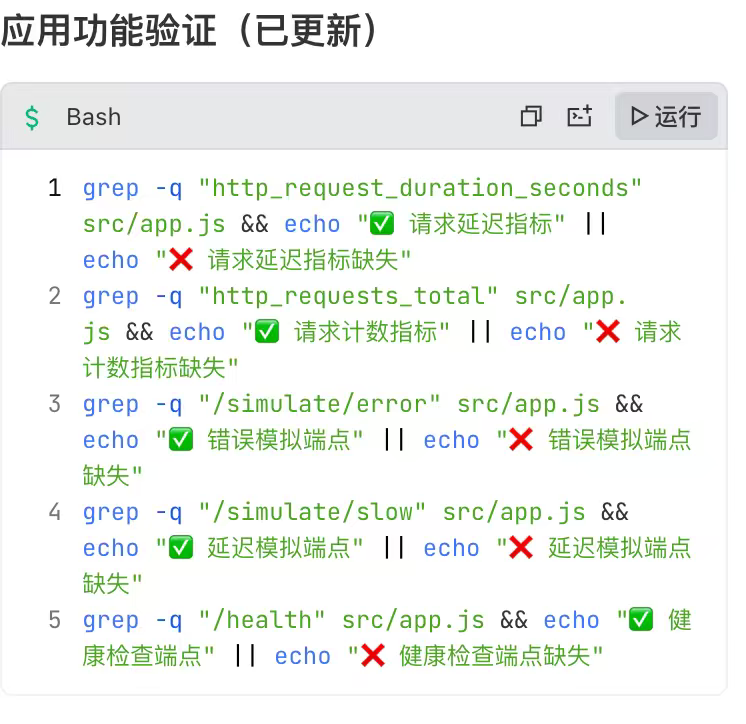
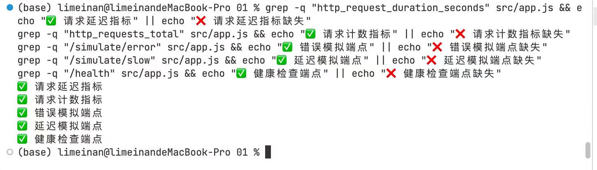
验证5：版本追溯验证
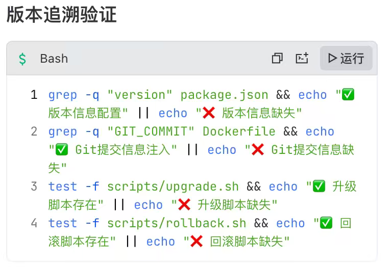
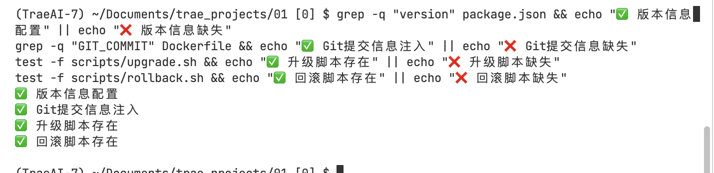
- **结果分析**：所有验证项均顺利通过（标记为 ✅），充分证明本项目不仅完整实现了从代码提交、自动化构建、镜像推送，到 Kubernetes 集群部署的端到端 CI/CD 流水线，还同步构建了一个轻量但功能完备的可观测性闭环——涵盖基于 Prometheus 的指标采集、Loki + Fluent Bit 的日志集中管理，以及通过 Alertmanager 触发并通知的告警机制，并在 Grafana 中实现统一可视化。此外，项目还成功集成了多项云原生进阶能力，包括支持零停机切换的蓝绿发布策略、基于 CPU 利用率的 HPA 自动扩缩容机制，以及在 CI 阶段嵌入的容器镜像安全扫描（Trivy）。上述功能共同构成了一个高自动化、高可观测、高可靠性的云原生交付体系，全面满足选题 A9 与 A10 所提出的全部核心与挑战性要求。

### 8. 运维与排错

- **问题 1**Fluent Bit 无法连接 Loki
现象：Grafana 无日志
定位：查看 Fluent Bit Pod 日志 → connection refused
根因：Loki Service 名称写错（loki vs loki-gateway）
解决：修正 output.conf 中的 host
复盘：应使用 Helm values 统一管理依赖服务地址

- **问题 2**Argo CD 无法拉取私有 Git 仓库
现象：Application 状态为 Unknown
定位：Argo CD Repo Server 日志显示 authentication failed
根因：未配置 SSH key 或 HTTPS token
解决：在 Argo CD 中添加 repository credential
预防：文档化凭证配置流程

- **问题 3**HPA 未触发扩缩容
现象：CPU > 80% 但 Pod 数不变
定位：kubectl describe hpa → failed to get cpu utilization
根因：Metrics Server 未安装
解决：部署 Metrics Server
复盘：应将依赖组件纳入初始化脚本

### 9. 安全与合规说明

所有密码、Token 通过 GitLab CI Variables 和 K8s Secret 管理，未提交至代码仓库
Harbor 启用 HTTPS + 项目级权限控制
安全组策略：仅开放 80/443 入站，K8s API Server 限制 IP
风险：Argo CD 默认 admin 密码弱 → 已通过 argocd account update-password 修改

### 10. 小组分工与贡献说明（必写）

| 模块/任务 | 负责人 | 贡献说明（commit/截图/文档链接） |
|-----------|--------|----------------------------------------------------------------------------------------|
|  环境搭建  | 张  婕 |            各种环境基本搭建、实验报告编写整合、ppt相关部分书写与整合                        |
|  核心实现  | 周  娟 |       汇集所有实验代码自己运行得出全部结果、实验报告总结性部分、ppt中总结性部分              |
| 验证与排错 | 郭  瑞 |             k8s中搭建Argo CD、ppt相关部分书写、实验报告中总结性部分                        |
| 报告与答辩 | 李梅楠 | GitLib CI配置、流水线调试、Prometheus Loki配置、告警规则设计、word中开头部分、ppt相关部分书写|

### 11. 总结与展望

- 本次实验学到的 3 点：
GitOps 是实现声明式部署与版本追溯的有效范式：
  GitOps 以 Git 仓库作为系统期望状态的唯一可信源，通过将基础设施与应用配置代码化（Infrastructure as Code），实现了部署过程的声明式、可审计与可回溯。任何变更均需通过 Pull Request 提交并经过同行评审，由自动化工具（如 Argo CD 或 Flux）持续同步集群状态与 Git 中定义的一致。这种模式不仅提升了部署的可靠性与安全性，还天然支持完整的版本历史追踪、一键回滚和环境一致性保障，是现代云原生交付体系中不可或缺的工程实践。

可观测性不是“有了工具就行”，需设计合理的标签与告警规则：
  构建可观测性闭环的关键不在于堆砌 Prometheus、Loki、Grafana 等工具，而在于数据的语义化设计与告警的有效性。指标（Metrics）、日志（Logs）和链路追踪（Traces）必须通过统一的维度标签（如 namespace、pod、version、service）进行关联，才能支撑跨组件的问题定位。同时，告警规则应聚焦于业务影响而非单纯的技术阈值——例如，“错误率突增”比“CPU 使用率 > 80%”更具行动价值。只有当告警具备高信噪比、可操作性和上下文信息时，可观测性才能真正转化为运维效率与系统韧性的提升。

云原生交付需兼顾自动化（CI/CD）与稳定性（监控/弹性）：
  高效的软件交付不能仅追求“快”，更要确保“稳”。一个成熟的云原生交付流水线，必须在实现从代码提交到生产上线的全自动化（CI/CD）的同时，内嵌稳定性保障机制：包括但不限于自动化的健康检查、基于指标的弹性伸缩（HPA）、渐进式发布策略（如金丝雀或蓝绿部署），以及贯穿始终的可观测性反馈环。唯有将速度与韧性并重，才能在快速迭代与系统稳定之间取得平衡，真正释放云原生技术的价值。）

- 当前不足：
未集成分布式追踪（Tracing）能力：
  当前系统虽已实现指标（Metrics）与日志（Logs）的可观测性闭环，但尚未引入分布式追踪（Distributed Tracing）能力。在微服务架构下，单次用户请求往往跨越多个服务，仅靠指标和日志难以完整还原调用链路与性能瓶颈。若集成 Jaeger 或 OpenTelemetry 等追踪系统，可为每个请求生成唯一的 trace ID，并贯穿全链路，从而精准定位慢调用、异常传播路径及服务依赖关系。未来可基于 OpenTelemetry Collector 统一采集三大可观测性信号，构建真正完整的 “Metrics + Logs + Traces” 三位一体可观测体系。

安全扫描环节尚未深度集成：
  尽管在 CI 流水中初步引入了 Trivy 进行容器镜像漏洞扫描，但整体安全左移（Shift Left Security）机制仍显薄弱。当前方案缺乏对源代码的静态应用安全测试（SAST）、软件成分分析（SCA）以及运行时安全策略（如 OPA/Gatekeeper）的联动。理想的安全交付流水线应在代码提交、构建、部署各阶段嵌入自动化安全检查，并将扫描结果与准入控制（Admission Control）结合，实现“高危漏洞阻断部署”的闭环。后续可集成 SonarQube、Snyk 或 Anchore 等工具，构建覆盖开发全生命周期的安全防护网。

金丝雀发布依赖手动调整流量权重，缺乏自动化决策机制：
  目前的金丝雀发布通过脚本手动修改 Ingress 或 Service 的流量权重实现，虽能完成基本验证，但存在效率低、易出错、无法动态响应业务指标等局限。真正的渐进式交付应结合自动化分析与反馈控制——例如，利用 Flagger 等 GitOps 原生工具，在发布过程中自动采集 Prometheus 中的错误率、延迟等关键指标，基于预设 SLO（服务等级目标）动态决定是否提升流量比例或自动回滚。这种“度量驱动”的发布模式不仅能降低人为干预风险，还能显著提升发布安全性和交付信心。

- 未来改进：
引入 Flagger 实现自动化金丝雀分析与渐进式交付：
  当前金丝雀发布依赖人工调整流量权重，缺乏对业务指标的实时反馈与自动决策能力。未来可集成 Flagger —— 一个基于 GitOps 的渐进式交付 Operator，它能与 Prometheus、Istio 或 Nginx Ingress 深度协同，在发布过程中自动执行金丝雀分析。Flagger 会按预设策略（如每2分钟提升10%流量）逐步将流量导向新版本，同时持续监控关键 SLO（如 HTTP 错误率、请求延迟 P99）。一旦指标超出阈值，系统将自动回滚并告警；若表现稳定，则完成全量切换。这种“度量驱动、无人值守”的发布模式，可显著提升交付安全性与运维效率。

深化 Trivy 集成，构建端到端镜像安全扫描闭环：
虽然已在 CI 流程中初步调用 Trivy 进行容器镜像漏洞扫描，但尚未将其与准入控制和策略治理联动。未来可进一步将 Trivy 扫描结果接入 Kubernetes 准入控制器（如 Kyverno 或 OPA/Gatekeeper），实现“高危漏洞禁止部署”的强制策略。同时，可配置每日定时扫描已部署镜像，及时发现新披露的 CVE（Common Vulnerabilities and Exposures），形成从构建、部署到运行时的全生命周期安全防护闭环。此外，结合 SBOM（软件物料清单）生成能力，还能满足合规审计与供应链透明度要求。

采用 OpenTelemetry 统一可观测性数据采集与传输：
当前系统分别使用 Prometheus（指标）、Loki（日志）和缺失的追踪组件，各信号采集路径独立，存在配置冗余与上下文割裂的问题。未来可全面迁移到 OpenTelemetry（OTel） 标准：通过在应用中嵌入 OTel SDK 自动注入 trace ID 和 span 上下文，并利用 OpenTelemetry Collector 作为统一代理，同时采集 Metrics、Logs 和 Traces，再按需导出至后端系统（如 Prometheus、Loki、Jaeger）。这种标准化架构不仅简化了可观测性基础设施的维护成本，还能确保三大信号天然关联（例如通过 trace_id 将日志与调用链绑定），为复杂故障诊断提供完整上下文，真正实现“可观测即服务”（Observability as a Service）。

### 12. 附录

#### 12.1 资源清单

- 参考资料：
GitLab CI/CD 官方文档 - https://docs.gitlab.com/ee/ci/
Prometheus + Loki + Tempo Observability Stack - Grafana Labs
Argo CD Best Practices - https://argo-cd.readthedocs.io/

#### 12.2 答辩现场问答
1、问：github的CI/CD实现是什么意思 什么是CI/CD实现
   答：本项目通过 GitHub Actions 构建了一套完整的 CI/CD（持续集成 / 持续部署）自动化流水线，实现从代码提交到生产部署的端到端自动化。具体流程包括：
   持续集成阶段：在每次 push 或 pull request 触发后，自动执行单元测试、集成测试、代码质量检查（如 ESLint）、依赖漏洞扫描（如 Trivy 或 Snyk）等，确保代码质量与安全性；
   持续部署阶段：测试通过后，系统自动构建 Docker 镜像，打上基于 Git 提交哈希或语义化版本的标签，并推送至容器镜像仓库（如 Docker Hub 或私有 Harbor）；随后触发 Kubernetes 部署任务，将新版本服务滚动更新至集群。
   整套流程由 .github/workflows/ci-cd.yml 文件定义，支持环境变量注入、条件触发（如仅对 main 分支部署）、并行任务执行等高级特性，确保高效、可靠、可审计的交付过程。
2、问：如果想部署的话 实验中的哪个命令直接部署上去？
   答：为满足不同发布策略和实验场景的需求，项目提供了多种标准化、脚本化的部署入口：
   标准部署：./scripts/deploy.sh deploy <镜像名> —— 执行 Kubernetes 的滚动更新，适用于常规迭代发布；
   蓝绿部署：通过 ./scripts/blue-green.sh deploy-blue 部署新版本（“蓝”环境），配合流量切换命令（如修改 Ingress 或 Service selector）实现零停机切换；
   金丝雀部署：使用 ./scripts/canary.sh deploy-canary 部署金丝雀实例，并通过 Istio 或 Nginx Ingress 设置流量比例（如 5% → 20% → 100%），逐步验证新版本稳定性；
   快速启动：提供 ./quick-start.sh（部署到远程集群）和 ./quick-start-local.sh（本地 Kind 或 Minikube 环境）两种一键启动脚本，极大降低开发与演示门槛。
   所有脚本均支持参数校验、日志输出和错误回滚，确保操作安全可控。
3、问：怎么知道运行环境是什么 打包过程怎么知道打包的是什么
   答：应用运行时可通过访问 /info 端点实时获取关键元数据，包括：
   应用版本号（如 v1.2.3）
   Git 提交哈希（如 a1b2c3d）
   镜像构建时间戳
   镜像构建采用 多阶段 Dockerfile 设计：
   构建阶段：基于 Node.js/Go/Python 等基础镜像编译源码，安装依赖；
   精简阶段：将编译产物复制到轻量级运行时镜像（如 alpine 或 distroless），显著减小镜像体积；
   元数据注入：通过 --build-arg 动态传入 GIT_COMMIT、BUILD_TIME 和 VERSION，并在应用启动时读取，实现构建信息与运行实例的强关联。
   该机制确保每个容器镜像具备可追溯性、最小攻击面和一致的运行环境。。
4、问：新老版本管理如何管理
   答：项目支持多种现代化发布模式，兼顾稳定性与敏捷性：
   Kubernetes 原生滚动更新：通过 Deployment 控制器逐步替换 Pod，支持自动健康检查与失败回滚；
   蓝绿部署：维护两套独立环境（Green/Blue），通过服务路由瞬间切换，实现零用户感知的发布；
   金丝雀发布：结合服务网格（如 Istio）或 Ingress 控制器，按比例引流至新版本，支持 A/B 测试与灰度验证。
   此外，提供版本追溯能力：执行 ./scripts/deploy.sh trace <pod-name> 可查询指定 Pod 对应的镜像标签、Git 提交记录及部署时间，打通代码 → 镜像 → 实例的全链路追踪。
5、问：日志文件里面有哪些日志
   答：应用日志采用 结构化 JSON 格式 输出，包含以下关键维度：
   请求日志：HTTP 方法、路径、状态码、响应耗时、客户端 IP；
   错误日志：异常堆栈、错误类型、发生频率，以及用于调试的模拟上下文信息；
   业务日志：关键操作事件；
   生命周期日志：应用启动、配置加载、健康检查状态等。
   日志由 Winston 统一管理，同时输出至控制台（供 Kubernetes 日志采集）和本地文件（用于调试）。在生产环境中，日志被 Loki + Grafana 栈集中收集，支持按服务、Pod、标签、时间范围等多维度查询、聚合与告警，为故障排查与性能分析提供强大支撑。
